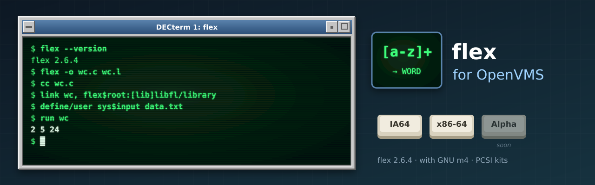

<p align="center">
  
</p>

# flex for OpenVMS

[flex](https://github.com/westes/flex) (**2.6.4**), the fast lexical analyser generator, built
natively for OpenVMS on **IA64** and **x86-64**, following flex's own releases. flex runs GNU m4 to
generate its scanners; it uses [GNU m4 for OpenVMS](https://github.com/issinoho/vms-m4), and takes
its POSIX regular expressions from [PCRE2 for OpenVMS](https://github.com/issinoho/vms-pcre2). It
belongs to the same family as [GNU grep](https://github.com/issinoho/vms-grep),
[GNU sed](https://github.com/issinoho/vms-sed), [GNU awk](https://github.com/issinoho/vms-awk),
[GNU make](https://github.com/issinoho/vms-make),
[GNU diffutils](https://github.com/issinoho/vms-diffutils),
[GNU patch](https://github.com/issinoho/vms-patch), [GNU m4](https://github.com/issinoho/vms-m4),
[GNU Bison](https://github.com/issinoho/vms-bison),
[GNU Wget](https://github.com/issinoho/vms-wget), [curl](https://github.com/issinoho/vms-curl),
[PCRE2](https://github.com/issinoho/vms-pcre2), [zlib](https://github.com/issinoho/vms-zlib),
[bzip2](https://github.com/issinoho/vms-bzip2), [XZ Utils](https://github.com/issinoho/vms-xz),
[Zstandard](https://github.com/issinoho/vms-zstd)
and [MariaDB](https://github.com/issinoho/vms-mariadb) for OpenVMS.

This repository holds **only our changes**: every build starts from the signed flex release
tarball (Will Estes's key, pinned in `keys/`), applies our patches and adds our VMS files.
As for grep, sed, m4 and Bison, flex's own `configure` runs on a Linux host with every
compile and link test sent to VSI C on the node, and MMS builds the result.

## Status

**Released: [v2.6.4-vms1](https://github.com/issinoho/vms-flex/releases/tag/v2.6.4-vms1).**

| | IA64 (OpenVMS V8.4-2L3, VSI C 7.4) | x86-64 (OpenVMS E9.2-4, VSI C 7.7) |
|---|---|---|
| VSI C configure answers (identical on both) | yes | yes |
| Builds | yes | yes |
| Smoke test: generate a scanner (flex runs m4) with a header, compile it, link it with `LIBFL` and `LIBFL_AS_IS` and run it, `-t` to a redirected `SYS$OUTPUT`, scanner error and missing m4 give error statuses, no temporary files left | 11/11 | 11/11 |
| Kit install (with the M4 kit), generate, link and run a scanner from the kit, remove | clean | clean |
| PCSI kit (`FLEX`, `V2.6-4E1`, requires `M4`) | `ISSINOHO-I64VMS-FLEX-V0206-4E1-1.PCSI` | `ISSINOHO-X86VMS-FLEX-V0206-4E1-1.PCSI` |

## Installing the kit

Install the [M4 kit](https://github.com/issinoho/vms-m4/releases/latest) first. Download
the flex kit for your architecture from the
[latest release](https://github.com/issinoho/vms-flex/releases/latest) and check it against
the release's `SHA256SUMS`. A kit downloaded through a non-VMS system loses its record
format, so restore that first, then install it:

```
$ SET FILE/ATTRIBUTE=(RFM:FIX,LRL:8192,MRS:8192,RAT:NONE) ISSINOHO-*-FLEX-V0206-4E1-1.PCSI
$ PRODUCT INSTALL FLEX /PRODUCER=ISSINOHO /SOURCE=dev:[dir]
$ @FLEX$ROOT:[000000]FLEX$SETUP.COM
$ flex -o wc.c FLEX$ROOT:[DOC]WC.L
$ CC wc.c
$ LINK wc, FLEX$ROOT:[LIB]LIBFL/LIBRARY
```

It installs `[FLEX.BIN]FLEX.EXE`; `LIBFL.OLB` (`yywrap()` and `main()` for scanners compiled
with VSI C's default `/NAMES=UPPERCASE`) and `LIBFL_AS_IS.OLB` (for `/NAMES=AS_IS`) in
`[FLEX.LIB]`; `FLEXLEXER.H` for C++ scanners in `[FLEX.INCLUDE]`; `FLEX$SETUP.COM` (defines
the `flex` command); the manual and an example scanner in `[FLEX.DOC]`; and
`SYS$STARTUP:FLEX$STARTUP.COM`, which defines `FLEX$ROOT` (add it to
`SYS$MANAGER:SYSTARTUP_VMS.COM` after the line for `M4$STARTUP.COM`). `PRODUCT REMOVE FLEX`
removes it.

## On VMS

- **Running m4.** On Unix flex sends its output through a chain of filters joined by pipes:
  copies of flex split off the header and fix the `#line` directives, and m4 expands the
  skeleton's macros. OpenVMS has no `fork()`. Every stage reads all its input before it
  ends, so here the stages run one after another over temporary files in `SYS$SCRATCH`
  once flex has finished (patch 0001). m4 runs in a subprocess (`LIB$SPAWN`), whose
  inherited `SYS$OUTPUT` is dropped, so `flex -t` into a redirected `SYS$OUTPUT` writes
  only the scanner. The M4 kit's `M4$ROOT:[BIN]M4.EXE` is the default; the `M4` logical name
  overrides it.
- **Regular expressions.** The VSI C run-time library has no `<regex.h>`; flex uses
  PCRE2's POSIX functions, linked into `FLEX.EXE` (nothing extra to install).
- **Output name.** Name the scanner with `-o`: the default `lex.yy.c` needs an ODS-5 disk.
- **Upper-case options in batch jobs.** Under the TRADITIONAL DCL parse style unquoted
  options reach flex in lower case: `-B` (batch) becomes `-b` (backing-up report), `-I`
  becomes `-i`. Use the long options (`--batch`), quote the short ones (`"-B"`), or
  `$ SET PROCESS/PARSE_STYLE=EXTENDED` first.
- **Exit status.** Under DCL a failed run has error severity, so `ON ERROR` works; under a
  GNV shell, `$?` is the exit code as on Unix.

## Patches

| Patch | Purpose |
|---|---|
| 0001 | `src/filter.c`, `src/main.c`, `src/flexdef.h`: run the output filter chain without `fork()` (temporary files, m4 through `LIB$SPAWN`); the VMS default for the m4 image; exit with a DCL severity. The Unix code path is unchanged. |
| 0002 | `src/flexdef.h`: declare `rpl_realloc` (VMS's `realloc(p, 0)` returns NULL, so `lib/realloc.c` replaces it) for `scan.c`, which includes `<stdlib.h>` before `config.h`. |
| 0003 | `src/main.c`: keep the program name `flex`, not the image file specification. |

## How to build

The build and smoke test need [vms-m4](https://github.com/issinoho/vms-m4) and
[vms-pcre2](https://github.com/issinoho/vms-pcre2) built on the node (`M4_TREE` and
`PCRE2_TREE` in `upstream.conf`). Set up `tools/nodes.conf` as described in
[vms-grep's README](https://github.com/issinoho/vms-grep#2b-build-on-vms-from-the-host-over-ssh).

```sh
git clone https://github.com/issinoho/vms-flex.git
cd vms-flex
tools/vms_configure.sh ia64 # VSI C configure run, about an hour (once per flex release)
tools/prepare.sh            # fetch + verify, patch, configure with the VSI C answers, MMS lists
tools/build.sh ia64         # upload, then @[.VMS]BUILD on the node (MMS)
tools/test.sh ia64          # smoke test (uses the node's m4 build)
tools/kit.sh ia64           # PCSI kit -> out/kits/
```

## Roadmap

1. flex's own test suite under GNV, as for grep and sed.
2. Offer patch 0001 (the filter chain without `fork()`) and 0002 to flex.
3. A port to OpenVMS **Alpha**.

The family of ports, all for IA64 and x86-64 (MariaDB: x86-64 only), each following its upstream releases:

| Port | Latest release | |
|---|---|---|
| GNU grep — [vms-grep](https://github.com/issinoho/vms-grep) | [v3.12-vms3](https://github.com/issinoho/vms-grep/releases/tag/v3.12-vms3) | with `grep -P` through PCRE2 |
| PCRE2 — [vms-pcre2](https://github.com/issinoho/vms-pcre2) | [v10.49-vms1](https://github.com/issinoho/vms-pcre2/releases/tag/v10.49-vms1) | the regular-expression library |
| GNU sed — [vms-sed](https://github.com/issinoho/vms-sed) | [v4.10-vms1](https://github.com/issinoho/vms-sed/releases/tag/v4.10-vms1) | the stream editor |
| GNU awk (gawk) — [vms-awk](https://github.com/issinoho/vms-awk) | [v5.4.1-vms1](https://github.com/issinoho/vms-awk/releases/tag/v5.4.1-vms1) | built with gawk's own VMS port |
| zlib — [vms-zlib](https://github.com/issinoho/vms-zlib) | [v1.3.2-vms1](https://github.com/issinoho/vms-zlib/releases/tag/v1.3.2-vms1) | the compression library |
| bzip2 — [vms-bzip2](https://github.com/issinoho/vms-bzip2) | [v1.0.8-vms1](https://github.com/issinoho/vms-bzip2/releases/tag/v1.0.8-vms1) | the bzip2 compressor and libbz2 |
| XZ Utils — [vms-xz](https://github.com/issinoho/vms-xz) | [v5.8.4-vms1](https://github.com/issinoho/vms-xz/releases/tag/v5.8.4-vms1) | xz and liblzma |
| Zstandard — [vms-zstd](https://github.com/issinoho/vms-zstd) | [v1.5.7-vms1](https://github.com/issinoho/vms-zstd/releases/tag/v1.5.7-vms1) | zstd and libzstd |
| curl — [vms-curl](https://github.com/issinoho/vms-curl) | [v8.22.0-vms2](https://github.com/issinoho/vms-curl/releases/tag/v8.22.0-vms2) | alongside VSI's curl kit, following curl's own releases |
| GNU Wget — [vms-wget](https://github.com/issinoho/vms-wget) | [v1.25.0-vms2](https://github.com/issinoho/vms-wget/releases/tag/v1.25.0-vms2) | the web retriever |
| GNU m4 — [vms-m4](https://github.com/issinoho/vms-m4) | [v1.4.21-vms1](https://github.com/issinoho/vms-m4/releases/tag/v1.4.21-vms1) | the macro processor |
| GNU Bison — [vms-bison](https://github.com/issinoho/vms-bison) | [v3.8.2-vms2](https://github.com/issinoho/vms-bison/releases/tag/v3.8.2-vms2) | the parser generator; runs GNU m4 |
| **flex** (this port) — [vms-flex](https://github.com/issinoho/vms-flex) | [v2.6.4-vms1](https://github.com/issinoho/vms-flex/releases/tag/v2.6.4-vms1) | the scanner generator; runs GNU m4 |
| GNU make — [vms-make](https://github.com/issinoho/vms-make) | [v4.4.1-vms1](https://github.com/issinoho/vms-make/releases/tag/v4.4.1-vms1) | built with make's own VMS port |
| GNU diffutils — [vms-diffutils](https://github.com/issinoho/vms-diffutils) | [v3.12-vms1](https://github.com/issinoho/vms-diffutils/releases/tag/v3.12-vms1) | cmp, diff, diff3, sdiff |
| GNU patch — [vms-patch](https://github.com/issinoho/vms-patch) | [v2.8-vms1](https://github.com/issinoho/vms-patch/releases/tag/v2.8-vms1) | applies diffs |
| MariaDB — [vms-mariadb](https://github.com/issinoho/vms-mariadb) | [v11.4.13-vms1](https://github.com/issinoho/vms-mariadb/releases/tag/v11.4.13-vms1) | server and clients; x86-64 only, preview |

## Artwork

`docs/images/banner.svg` and `docs/images/icon.svg` were made for this project in the style
of classic DECwindows and VT terminals, like those of its sibling ports.

## Licence

flex is free software under a BSD-style licence; see `COPYING`. Our patches and VMS files
are distributed under the same terms.

OpenVMS is a trademark of VMS Software, Inc. This project is not affiliated with VMS
Software, Inc. or with the flex project.
